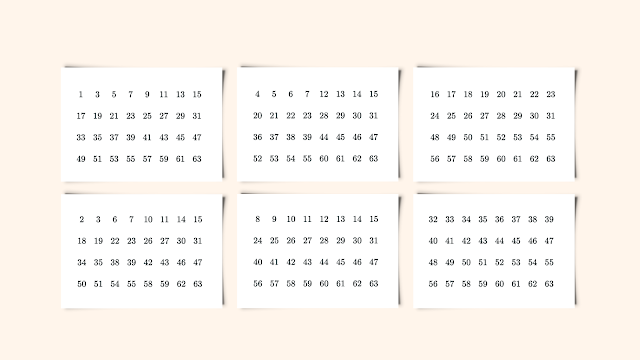

# Maths Magic Trick

At Christmas, lucky individuals might find a surprise waiting in their Christmas crackers. Besides the usual mini deck of cards, micro pen and tiny book, the luckiest of the bunch can find themselves with a magic trick. One of which is the **Mystery Calculator**.

For this trick, the "magician" holds out a set of cards like the ones below.

The "magician" asks the unsuspecting friend or family member to pick a number on one of the cards. They then show each card and ask which ones contain the number that they are thinking of. The "magician" can then ~~magically~~ mathematically determine what number their friend or family member was thinking.

### Behind the magical curtain

The so-called magician keeps the cards that contain the number that their victims are thinking of to the side. They then sum the first number of each card together, to guess the number. 

*How does it work?* The answer is binary numbers!

### Do the trick yourself

If you want to impress people with this trick, [this Shiny app](https://sriley3.shinyapps.io/MathsMagic/) will generate as many (or as few) cards as you would like.
